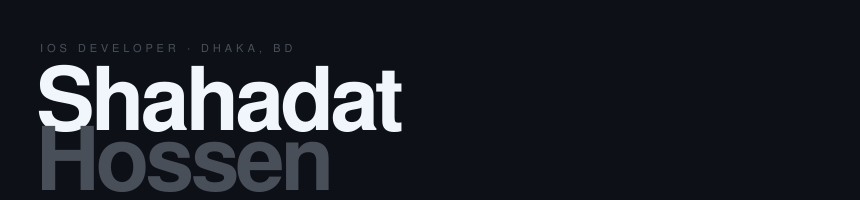

<div align="center">



</div>

<br>

<div align="center">

[](https://portfolioshahadat.vercel.app)&nbsp;
[](https://www.linkedin.com/in/shahadat-hossen-25bb59331/)&nbsp;
[](mailto:ios.shahadathossen@gmail.com)&nbsp;
[](https://leetcode.com/u/itsmearyan10/)

</div>

<br>

```
Currently   →  Junior iOS Developer @ CIBL, Dhaka Cantonment
               ▸ National Bank Ltd. — NBLiPower
               ▸ Trust Bank — Trust Money

Education   →  BSc CSE · Northern University of Bangladesh
Previously  →  AppExits
```

<br>

## ⌦ Stack

<div align="center">


</div>

<br>

## ⌦ Projects

<br>

<div align="center">

| &nbsp; | Project | Description | Stack |
|:---:|:---|:---|:---|
| `01` | **NBLiPower** | iOS banking — National Bank Ltd. Account mgmt, fund transfers, NPSB, bill pay | `Swift` `UIKit` `MVC` |
| `02` | **Trust Money** | Banking app — FDR/DPS modules, bKash & Nagad wallet integration | `Alamofire` `CoreData` |
| `03` | **AIVideoGencut** | AI-assisted video editor — smart cut, auto-enhance, export | `AVFoundation` `VisionKit` |
| `04` | [**ChatBuddy**](https://github.com/shahadat-100/ChatBuddy-FSP) | Real-time iOS chat — Firebase backend, MessageKit UI | `Swift` `Firebase` |
| `05` | [**ExpenseX**](https://github.com/shahadat-100/ExpenseX) | Personal finance & budget tracker | `Swift` `CoreData` |
| `06` | [**CloudCast**](https://github.com/shahadat-100/CloudCast) | Live weather forecast app | `Swift` `REST API` |

</div>

<br>

## ⌦ Activity

<div align="center">


<br><br>


</div>

<br>

---

<div align="center">
<sub>SHAHADAT HOSSEN &nbsp;·&nbsp; iOS DEVELOPER &nbsp;·&nbsp; DHAKA BD</sub>
</div>
